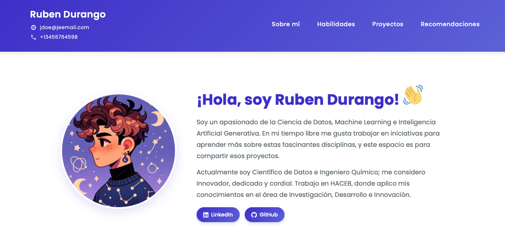

# Proyecto de Portafolio

[🔗 **VISITA EL PORTAFOLIO AQUÍ**](https://rdurango92.github.io/portfolio_project_IBM/)

## Descripción
Este es un proyecto de portafolio desarrollado con fines educativos para aprender desarrollo web. No representa un portafolio real ni contiene información profesional verdadera.

## Propósito
El objetivo principal de este proyecto es:
- Practicar HTML, CSS y JavaScript básico
- Aprender sobre diseño web responsivo
- Entender la estructura de una página web de portafolio profesional
- Familiarizarse con el control de versiones usando Git y GitHub

## Estructura del Proyecto
- **index.html**: Página principal del portafolio
- **style.css**: Estilos CSS para dar formato a la página web
- **script.js**: Funcionalidades interactivas del portafolio

## Demostración en vivo
El proyecto está desplegado usando GitHub Pages y puede ser visitado en:
[https://rdurango92.github.io/portfolio_project_IBM/](https://rdurango92.github.io/portfolio_project_IBM/)

## Tecnologías Utilizadas
- HTML5
- CSS3 (con variables CSS para mantener consistencia en los colores y estilos)
- JavaScript
- Google Fonts

## Cómo Usar
1. Clona este repositorio en tu ordenador local
2. Abre el archivo `index.html` en tu navegador web
3. Explora las diferentes secciones del portafolio
4. Estudia el código para aprender sobre la implementación

## Características Incluidas
- Diseño responsivo que se adapta a diferentes tamaños de pantalla
- Secciones para mostrar habilidades, proyectos y recomendaciones
- Formulario de contacto simulado
- Navegación sencilla e intuitiva

## Nota Importante
Este proyecto es solo para fines educativos y no debe ser utilizado como un portafolio profesional real. Los datos, proyectos y referencias que aparecen son ficticios y solo sirven para demostrar las capacidades del desarrollo web.

## Recursos de Aprendizaje
Si estás aprendiendo desarrollo web, estos recursos pueden ser útiles:
- [MDN Web Docs](https://developer.mozilla.org/)
- [W3Schools](https://www.w3schools.com/)
- [freeCodeCamp](https://www.freecodecamp.org/)
